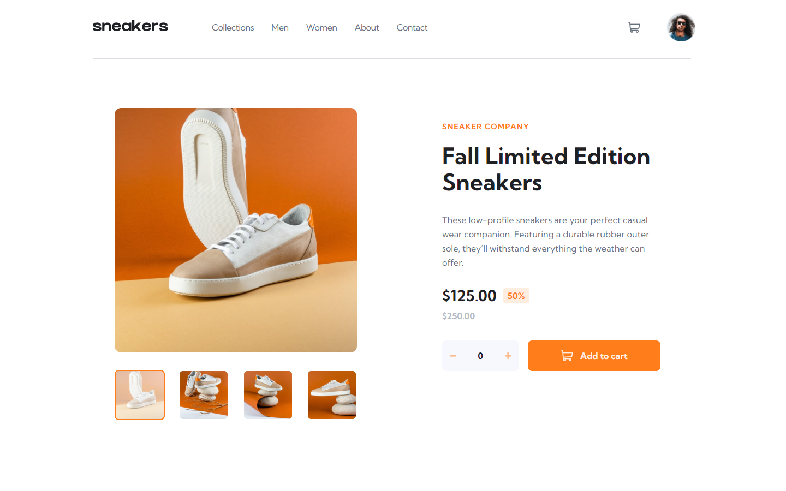

# Frontend Mentor - E-commerce product page solution

This is a solution to the [E-commerce product page challenge on Frontend Mentor](https://www.frontendmentor.io/challenges/ecommerce-product-page-UPsZ9MJp6). Frontend Mentor challenges help you improve your coding skills by building realistic projects.

I am using this challenge to try stitches. Stitches is a css-in-js library.

## Table of contents

- [Overview](#overview)
  - [The challenge](#the-challenge)
  - [Screenshot](#screenshot)
  - [Links](#links)
- [My process](#my-process)
  - [Built with](#built-with)
  - [Continued development](#continued-development)
- [Author](#author)
## Overview

### The challenge

Users should be able to:

- View the optimal layout for the site depending on their device's screen size
- See hover states for all interactive elements on the page
- Open a lightbox gallery by clicking on the large product image
- Switch the large product image by clicking on the small thumbnail images
- Add items to the cart
- View the cart and remove items from it

---
### Screenshot
 

---
### Links

- Solution URL: [Add solution URL here](https://www.frontendmentor.io/solutions/reactjs-stitches-swiper-typescript-FRSKzYeap)
- Live Site URL: [Add live site URL here](https://stitches-poc.vercel.app/)

## My process
### Built with

- Semantic HTML5 markup
- Flexbox
- CSS Grid
- Mobile-first workflow
- [React](https://reactjs.org/) - Framework
- [Stitches](https://stitches.dev/) - For styles
- Eslint
- Prettier
- Husky
- Commitlint

---
### Continued development

I want to keep improving this project. My focus was to try Stitches.dev and build reusable components following the best pratices of acessibility, but it still has some problems.

## Author

- Frontend Mentor - [@FelipeDecome](https://www.frontendmentor.io/profile/FelipeDecome)
- Linkedin - [@FelipeDecome](https://www.linkedin.com/in/felipedecome/)
